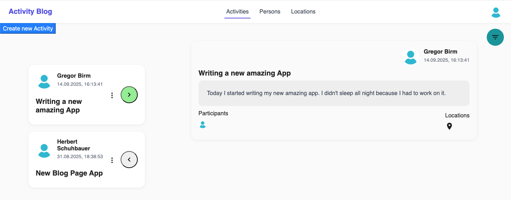
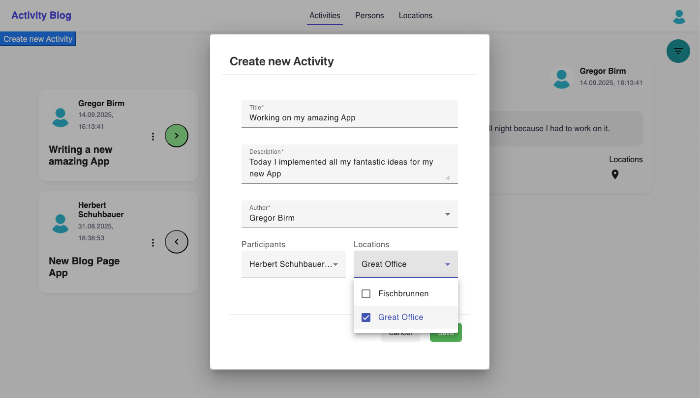
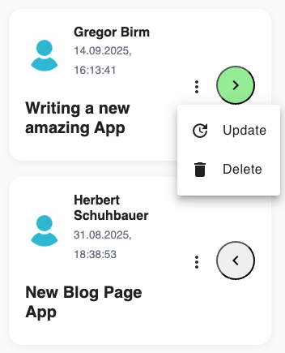
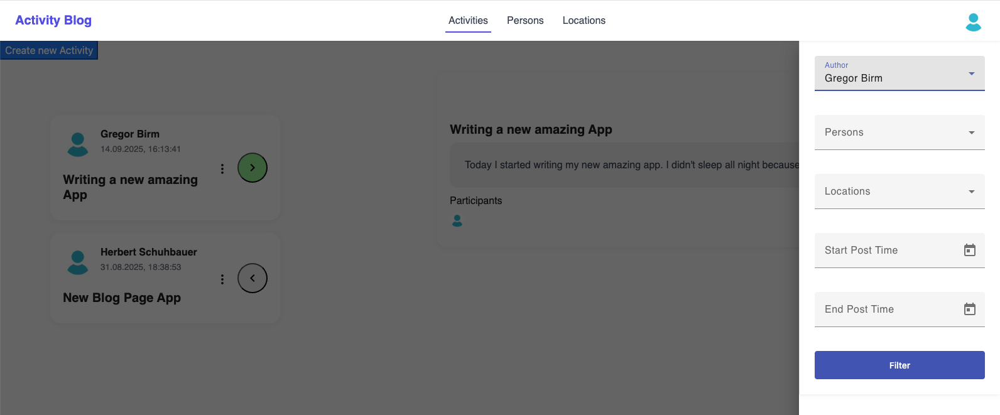
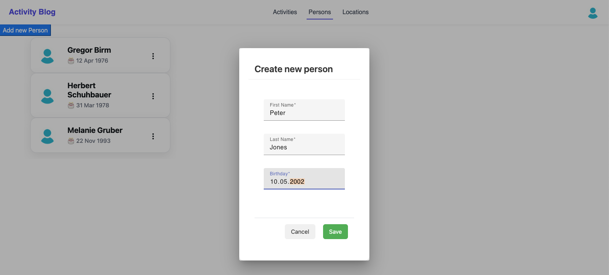
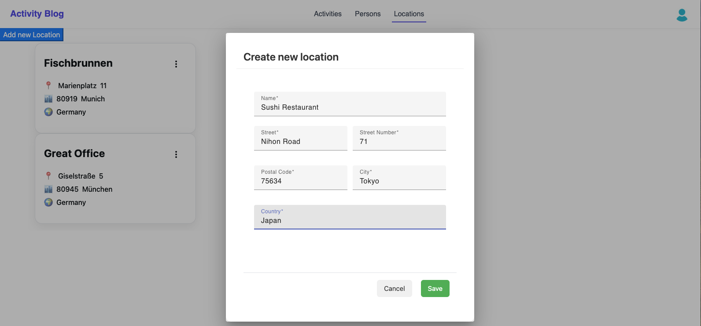

# Activity Blog

> This project is also available in German: [README_DE.md](README_DE.md)

This project was developed as a **demo for job applications**. It demonstrates how I build and deploy a small fullstack application with **frontend, backend, and infrastructure**.  
My focus was on **clean structure**, **containerization**, and **deployment with Kubernetes**.

# Table of Contents

1. Project Goal
2. Project Description
3. Screenshots
3. Tests
4. Installation & Start
    - Development Mode
    - Kubernetes Deployment
5. Technologies
6. Author

# Project Goal

This project is meant to showcase my working style:

- Development of a web application with **frontend** and **backend**
- Use of **Docker** for easy local development
- Deployment on **Kubernetes** with custom Bash scripts
- Documentation and automation as required in real-world projects

# Project Description

Users can blog their activities and experiences. They can create persons and locations and link them to activities.

> Note: This project is a **learning and showcase project**. It is not a finished product.

# Screenshots

## Activities Tab
<p align="center">
  
</p>

In the Activity Tab you can see the overview of the activities of all people. On the left hand side you see the title, author and post date. On the right hand side you see further details of the selected activity, like description, people who were involved and the locations where the activity took place.

## Create Activity Dialog
<p align="center">
  
</p>

In the Create Activity Dialog you can create a new activity.

## Update and delete Activity

<p align="center">
  
</p>

In the dropdwon menu of the three dots you can update and delete an Activity.

## Activity Filter Drawer

<p align="center">
  
</p>

Press the filter icon in the upper right corner to open the activity filter. You can filter activities by author, participating persons, locations and by a time window in which the activity was posted.

## Create person dialog

<p align="center">
  
</p>

In the create person dialog you can create new persons who can be selected as author or participating people in activities.

## Create location dialog

<p align="center">
  
</p>

In the create location dialog you can create new locations which can be selected where the activities took place.

# Tests

- **Backend:** `backend/src/test/java/activity`
- **Frontend:** `frontend/src/app/pages/activity-list/activity-list.component.spec.ts`

> Example tests are included, but there is not 100% test coverage.

## Frontend Highlight

In the frontend, I particularly focused on the **Activity List component**.  
For example, I implemented a **smooth scroll fade effect**, demonstrating dynamic styling, DOM manipulation, and interactive UI behavior.

The code can be found in:
`frontend/src/app/pages/activity-list/activity-list.component.ts`

# Requirements

Before starting the project, make sure the following tools are installed:

## Development Mode

- **Java 17+** (for the backend with Quarkus; required because the Maven Wrapper relies on Java)
- **Maven Wrapper** (`./mvnw` is included and automatically downloads a compatible Maven version)
- **Node.js 16+** (for the Angular frontend)
- **npm** (for frontend dependencies)
- Optional: **Docker**, if backend databases are run via containers

## Kubernetes Deployment

- **Minikube** (local Kubernetes cluster)
- **kubectl** (Kubernetes CLI)
- **Docker** (for building service images)
- Note: To access services from the host, you may need to open a **Minikube tunnel** (`minikube tunnel`)


# Installation & Start

There are two ways to start the application: **development mode** or **Kubernetes deployment**.

## Development Mode

1. Make the script executable (first time only):

```bash
chmod +x ./scripts/start-in-dev-mode.sh
```

2. Run with setup on first start:

```bash
./scripts/start-in-dev-mode.sh --setup
```

3. For subsequent starts in development mode:

```bash
./scripts/start-in-dev-mode.sh
```

> The script will automatically open the frontend in your browser.

- Frontend: [http://localhost:4200](http://localhost:4200)
- Backend API: [http://localhost:8080/api](http://localhost:8080/api)

## Kubernetes Deployment

### Backend API Access
The frontend uses the Hostname `activity-blog.local` for the API. For the frontend to work properly,
`activity-blog.local` must point to the IP of the running backend:

If you are running the backend locally, you can add the following line to your hosts file:
```text
127.0.0.1 activity-blog.local
```
- macOS/Linux: `/etc/hosts`
- Windows: `C:\Windows\System32\drivers\etc\hosts`


You can decide to **build the images locally** or **load them from the GitHub Container Registry (GHCR)**.

Make the script executable (once):
- If you want to build the images locally:
```bash
chmod +x ./scripts/k8s-deployment.sh
```
- If you want to load the images from GHCR:
```bash
chmod +x ./scripts/run-with-ghcr-images.sh
```

Start Minikube (if not already running):
```bash
minikube start
```
Start the deployment:
- If you want to build the images locally:
```bash
./scripts/k8s-deployment.sh
```
- If you want to load the images from GHCR:
```bash
./scripts/run-with-ghcr-images.sh
```

Open a Minikube tunnel to make all services reachable from the host:
```bash
minikube tunnel
```
Enter your password if prompted.

Open the frontend in the browser:
```bash
minikube service activity-blog-frontend
```

> Flyway migrations are executed automatically.

# Technologies

- **Frontend:** Angular
- **Backend:** Quarkus
- **Database:** PostgreSQL
- **Containerization:** Docker & Docker Compose
- **Orchestration:** Kubernetes
- **CI/CD:** Automated deployment pipeline

# Author

👤 **Seraphin Aeschbach**  
🔗 [LinkedIn](https://www.linkedin.com/in/seraphinae/)
