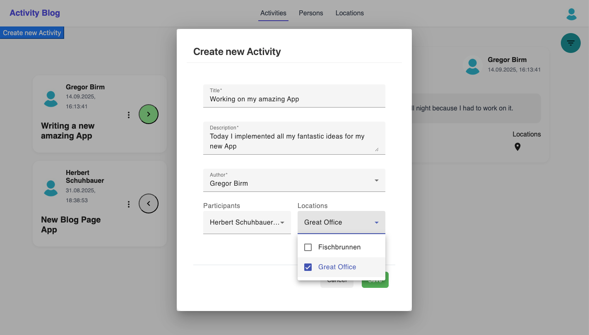
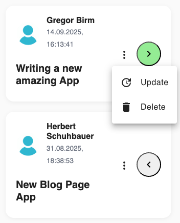
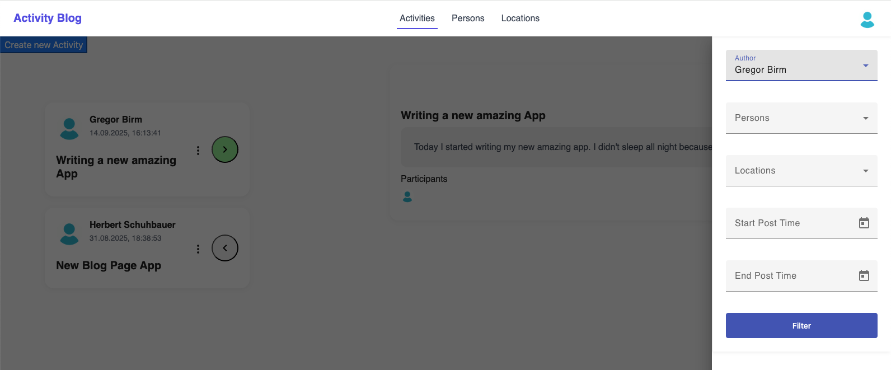
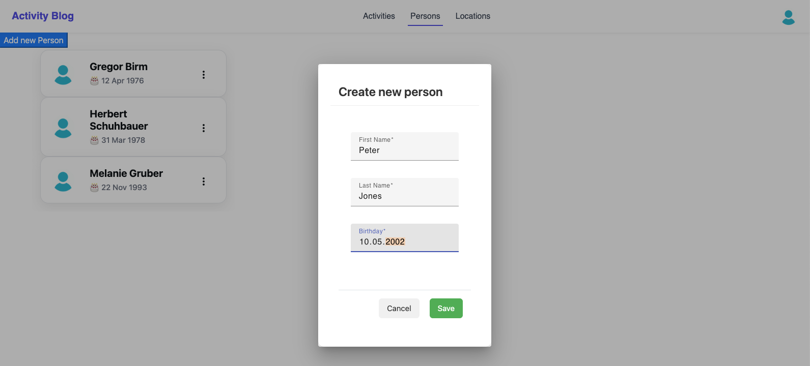
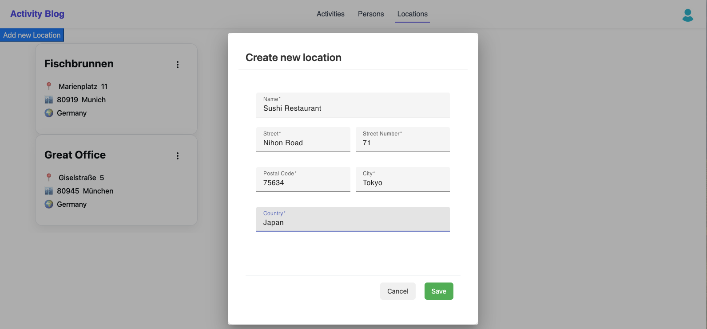

# Activity Blog

> Dieses Projekt ist auch auf Englisch verfügbar: [README.md](README.md)

Dieses Projekt habe ich als **Demo für Bewerbungen** entwickelt. Es zeigt, wie ich eine kleine Fullstack-Anwendung mit **Frontend, Backend und Infrastruktur** aufbaue und bereitstelle.  
Mein Fokus lag auf **sauberer Struktur**, **Containerisierung** und **Deployment mit Kubernetes**.

# Inhaltsverzeichnis

1. Ziel des Projekts
2. Projektbeschreibung
3. Screenshots
3. Tests
4. Installation & Start
   - Entwicklungsmodus
   - Kubernetes Deployment
5. Technologien
6. Autor

# Ziel des Projekts

Dieses Projekt soll meine Arbeitsweise demonstrieren:

- Entwicklung einer Webanwendung mit **Frontend** und **Backend**
- Nutzung von **Docker** für einfache lokale Entwicklung
- Deployment in **Kubernetes** mit eigenen Bash-Skripten
- Dokumentation und Automatisierung, wie sie in echten Projekten benötigt werden

# Projektbeschreibung

Benutzer können ihre Aktivitäten und Erlebnisse bloggen. Dabei können sie Personen und Locations anlegen und diese mit Aktivitäten verknüpfen.

> Hinweis: Das Projekt ist ein **Lern- und Showcase-Projekt**. Es handelt sich nicht um ein fertiges Produkt.


# Screenshots

## Activities Tab
<p align="center">
  
</p>

Im Activity Tab sieht man die Übersicht über die Aktivitäten aller Leute. Links sieht man den Titel, Autor und Post Datum. Rechts sieht man weitere Details der ausgewählten Aktivität, wie Beschreibung, Leute, die beteiligt waren und die Orte, an denen die Aktivität stattfand.

## Create Activity Dialog
<p align="center">
  
</p>

Im Create Activity Dialog kann man eine neue Aktivität erstellen.

## Update and delete Activity

<p align="center">
  
</p>

Im Dropdown Menu der drei Punkte kann man eine Aktivity aktualisieren oder löschen.

## Activity Filter Drawer

<p align="center">
  
</p>

Drücke das Filter Icon in der oberen rechten Ecke, um den Activity Filter zu öffnen. Man kann Aktivitäten nach Autor, teilnehmenden Personen, Orten und nach dem Zeitfenster filtern, in dem die Aktivität stattfand.

## Create person dialog

<p align="center">
  
</p>

Im Create Person Dialog kann man neue Personen erstellen, die als Autor oder teilnehmende Person in Aktivitäten ausgewählt werden können.

## Create location dialog

<p align="center">
  
</p>

Im Create Locations Dialog kann man neue Orte erstellen, die als Ort ausgewöhlt werden können, an dem eine Aktivität stattfand.

# Tests

- **Backend:** `backend/src/test/java/activity`
- **Frontend:** `frontend/src/app/pages/activity-list/activity-list.component.spec.ts`

> Es gibt beispielhafte Tests, aber keine 100 % Testabdeckung.

## Frontend-Highlight

Im Frontend habe ich mich besonders in der **Opacity Scroll Komponente** ausgetobt.  
Hier habe ich einen **smooth scroll fade Effekt** umgesetzt, der zeigt, wie ich mit dynamischem Styling, DOM-Manipulation und interaktiven UI-Elementen arbeite.

Der Code dazu befindet sich in:
`frontend/src/app/shared/opacity-scroll/opacity-scroll.component.ts`

# Voraussetzungen

Bevor Sie das Projekt starten, stellen Sie sicher, dass folgende Tools installiert sind:

## Entwicklungsmodus

- **Java 17+** (für das Backend mit Quarkus; erforderlich, da der Maven Wrapper Java nutzt)
- **Maven Wrapper** (`./mvnw` ist bereits enthalten und lädt automatisch eine passende Maven-Version herunter)
- **Node.js 16+** (für das Angular-Frontend)
- **npm** (für Frontend-Abhängigkeiten)
- Optional: **Docker**, wenn Backend-Datenbanken per Container gestartet werden sollen

## Kubernetes Deployment

- **Minikube** (lokales Kubernetes-Cluster)
- **kubectl** (Kubernetes CLI)
- **Docker** (für die Images der Services)
- Hinweis: Für den Zugriff auf Services vom Host muss ggf. ein **Minikube-Tunnel** geöffnet werden (`minikube tunnel`)


# Installation & Start

Es gibt zwei Möglichkeiten, die Anwendung zu starten: **Entwicklungsmodus** oder **Kubernetes Deployment**.

## Entwicklungsmodus

1. Skript ausführbar machen (nur beim ersten Mal):

```bash
chmod +x ./scripts/start-in-dev-mode.sh
```

2. Beim ersten Mal Starten mit Setup ausführen:

```bash
./scripts/start-in-dev-mode.sh --setup
```

3. Wenn man es später erneut im Entwicklungsmodus starten will, reicht:

```bash
./scripts/start-in-dev-mode.sh
```

> Das Skript öffnet automatisch das Frontend im Browser.

- Frontend: [http://localhost:4200](http://localhost:4200)
- Backend API: [http://localhost:8080/api](http://localhost:8080/api)

## Kubernetes Deployment

### Backend API Zugriff
Das Frontend nutzt den Hostnamen `activity-blog.local` für die API. Damit das Frontend richtig läuft,
muss `activity-blog.local` auf die IP des laufenden Backends zeigen:

Wenn sie das Backend lokal laufen lassen, können Sie folgende Zeile zu ihrem Host File hinzufügen:
```text
127.0.0.1 activity-blog.local
```
- macOS/Linux: `/etc/hosts`
- Windows: `C:\Windows\System32\drivers\etc\hosts`

Sie können sich entscheiden **die Images lokal zu bauen** oder sie **von der GitHub Container Registry (GHCR)** zu laden.

1. Skript ausführbar machen (nur einmal):
- Wenn Sie die Images lokal bauen wollen:
```bash
chmod +x ./scripts/k8s-deployment.sh
```
- Wenn sie die images von GHCR laden wollen:

```bash
chmod +x ./scripts/run-with-ghcr-images.sh
```

2. Minikube starten (wenn es noch nicht läuft):
```bash
minikube start
```

3. Deployment starten:
- Wenn Sie die images lokal bauen wollen:
```bash
./scripts/k8s-deployment.sh
```
- Wenn sie die images von GHCR laden wollen:
```bash
./scripts/run-with-ghcr-images.sh
```

4. Minikube Tunnel öffnen, damit alle Services vom Host erreichbar sind:

```bash
minikube tunnel
```

- Passwort ggf. eingeben.

5. Frontend im Browser öffnen:

```bash
minikube service activity-blog-frontend
```

> Flyway-Migrationen werden automatisch ausgeführt.

# Technologien

- **Frontend:** Angular
- **Backend:** Quarkus
- **Datenbank:** PostgreSQL
- **Containerisierung:** Docker & Docker Compose
- **Orchestrierung:** Kubernetes
- **CI/CD:** Pipeline für automatisiertes Deployment

# Autor

👤 **Seraphin Aeschbach**  
🔗 [LinkedIn](https://www.linkedin.com/in/seraphinae/)
